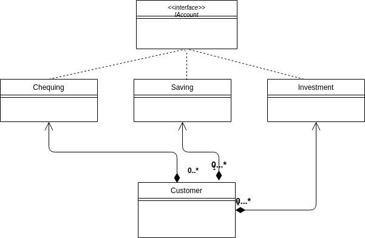
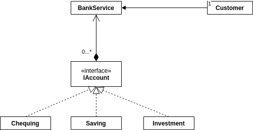

# Facade Design Pattern

Used to simplify complex system.
To simplify client interaction.
Facade design pattern provides a ___single simplified interface___ for client classes to interact with the subsystem.

Ex: Off to eat in a restaurant - A person looking for sign of the face of the building which indicates the contents within the structure can provide you with the dining service.

Online order - One will look for outward indication of virtual storefront.
Online order processing - hiding the number of processing in backend.

Facade doesn't add any functionality- It will act as a entry point to the subsystem.

A facade is a ___wrapper class___ that encapsulates the subsystem in order to hide the subsystem's complexity.
This wrapper class will allow the client class to interact with the subsystem through a facade.



With facade


```java

public interface IAccount
{
  public void deposit(BigDecimal amount);
  public void withdraw(BigDecimal amount);
  public void transfer(BigDecimal amount);
  public Integer getAccountNumber();
}

public class Chequing implements IAccount {....}
public class Saving implements IAccount {....}
public class Investment implements IAccount {....}

public class BankService
{
  private Hashtable<int, IAccount> bankAccounts;
  public BankService()
  {
    this.bankAccounts = new Hashtable<int, IAccount>;
  }
  public int createNewAccount(String type, BigDecimal initialAmount)
  {
    IAccount newAccount = null;
    switch(type)
    {
      case "saving":
      newAccount = new Savings(initialAmount);
      break;
      case "chequing":
      newAccount = new Chequing(initialAmount);
      break;
      case "investment":
      newAccount = new Investment(initialAmount);
      default:
      System.out.println("Invalid Account type");
      break;
    }
    if(newAccount!=null)
    {
      this.bankAccounts.put(newAccount.getAccountNumber(),newAccount);
      return newAccount.getAccountNumber();
    }
    return -1;
  }
}
```

Private account - by information hiding design principle in BankService facade - private member Hashtable with account number and pertaining specialised account object

What are the key design principles are used to implement the facade design pattern?

--> Encapsulation, Information Hiding and separation of concerns.

Facade design pattern -
* Structural Design pattern
* Wrapper class which acts as an entry point to the subsystems.
* This encapsulating unified wrapper class doesn't add new functionality to the subsystems.
* Removes the need for the client classes to create and manage the subsystems and thus resulting in less coupling of client class and the subsystems.
* Facade responsibility - instantiation and redirection to appropriate class within a subsystem.
* Provides client class - a simple interface for the subsystem.
