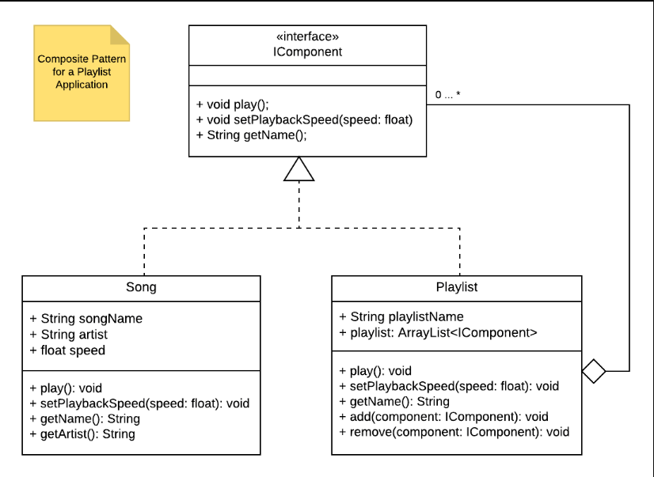
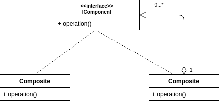

# Composite Design pattern

Building composed of different structures - rooms, Building
both have entry and exit but properties differ.

Design goals:
1. To compose nested structures of objects.
2. Deal with these objects of classes uniformly.





--------------------
[Program.java]
--------------------
```java
public class Program {

	public static void main(String args[]) {

	// Make new empty "Study" playlist
	Playlist studyPlaylist = new Playlist("Study");

	// Make "Synth Pop" playlist and add 2 songs to it.
	Playlist synthPopPlaylist = new Playlist("Synth Pop");
	Song synthPopSong1 = new Song("Girl Like You", "Toro Y Moi" );
	Song synthPopSong2 = new Song("Outside", "TOPS");
	synthPopPlaylist.add(synthPopSong1);
	synthPopPlaylist.add(synthPopSong2);

	// Make "Experimental" playlist and add 3 songs to it,
	// then set playback speed of the playlist to 0.5x
	Playlist experimentalPlaylist = new Playlist("Experimental");
	Song experimentalSong1 = new Song("About you", "XXYYXX");
	Song experimentalSong2 = new Song("Motivation", "Clams Casino");
	Song experimentalSong3 = new Song("Computer Vision", "Oneohtrix Point Never");
	experimentalPlaylist.add(experimentalSong1);
	experimentalPlaylist.add(experimentalSong2);
	experimentalPlaylist.add(experimentalSong3);
	float slowSpeed = 0.5f;
	experimentalPlaylist.setPlaybackSpeed(slowSpeed);

	// Add the "Synth Pop" playlist to the "Experimental" playlist
	experimentalPlaylist.add(synthPopPlaylist);

	// Add the "Experimental" playlist to the "Study" playlist
	studyPlaylist.add(experimentalPlaylist);

	// Create a new song and set its playback speed to 1.25x, play this song,
	// get the name of glitchSong → "Textuell", then get the artist of this song → "Oval"
	Song glitchSong = new Song("Textuell", "Oval");
	float fasterSpeed = 1.25f;
	glitchSong.setPlaybackSpeed(fasterSpeed);
	glitchSong.play();
	String name = glitchSong.getName();
	String artist = glitchSong.getArtist();
	System.out.println ("The song name is " + name );
	System.out.println ("The song artist is " + artist );

	// Add glitchSong to the "Study" playlist
	studyPlaylist.add(glitchSong);

	// Play "Study" playlist.
	studyPlaylist.play();

	// Get the playlist name of studyPlaylist → "Study"
	System.out.println ("The Playlist's name is " + studyPlaylist.getName() );
	}
}
```

```java
--------------------
[IComponent.java]
--------------------
public interface IComponent {

// Your code goes here!

public void play();
public void setPlaybackSpeed(float speed);
public String getName();


}
```
--------------------
[Playlist.java]
--------------------
```java
public class Playlist implements IComponent {

	public String playlistName;
	public ArrayList<IComponent> playlist = new ArrayList();

	public Playlist(String playlistName) {
		this.playlistName = playlistName;
	}

  // Your code goes here!

  public void play()
	{
   for(IComponent aComponent:playlist)
	 {
	 aComponent.play();
	 }
	}

	public void setPlaybackSpeed(float speed)
	{
	for(IComponent aComponent: this.playlist)
	{
	  aComponent.setPlaybackSpeed(speed);
	}
	}

	public String getName()
	{
		return this.playlistName;
	}

	public void add(IComponent aComponent)
	{
		this.playlist.add(aComponent);
	}

	public void remove(IComponent aComponent)
	{
		this.playlist.remove(aComponent);
	}
}
```
```java
--------------------
[Song.java]
--------------------
public class Song implements IComponent {
	public String songName;
	public String artist;
	public float speed = 1; // Default playback speed

	public Song(String songName, String artist ) {
		this.songName = songName;
		this.artist = artist;
	}

	public void play()
	{
	  System.out.println("Playing song"+ this.getName());
	}

	public void setPlaybackSpeed(float speed)
	{
	  this.speed = speed;
	}

	public String getName()
	{
	  return this.songName;
	}

  public String getArtist()
	{
	  return this.artist;
	}
}
```
