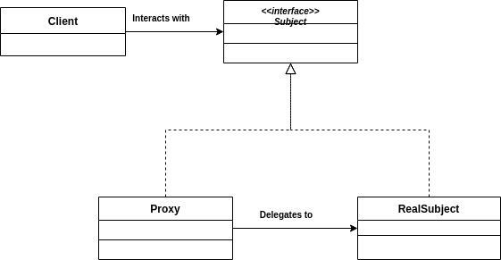
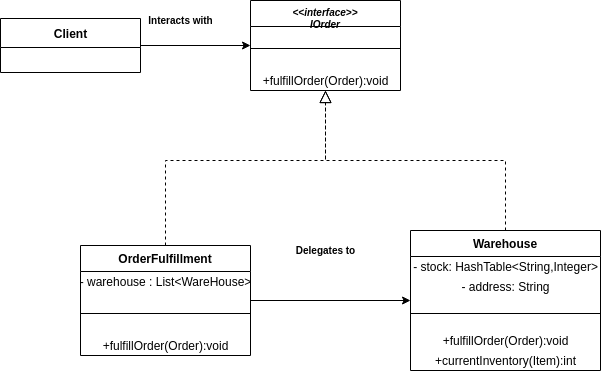

# Proxy Design Pattern

Proxy acts as a simplified or lightweight version of the original object.

Proxy class hides real subject class.
Ex: Credit card in place of cash for payment.

More secure and less resource intensive system building.

Usecases of proxy Design pattern:
  1. Virtual proxy where proxy class is used in place instead of real subject class.
     Ex: Single High resolution images which are of more memory space.
  2. Protection proxy to in order to control access of subject class
     Ex: Password and credential checking in learning management system - different subject class for user - faculty/ student.
  3. Proxy  acting as a Remote proxy  Proxy class--> local whereas Real subject class can be accessed remotely.




About Proxy design pattern:

1. Proxy and RealSubject are subtypes of Subject.
2. The proxy design pattern achieves polymorphism through implementing a Subject interface.

Ex: Online retail store

--> System to redirect order to appropriate warehouse to prevent from warehouse from receiving an order which it cannot fully fulfill.



```java

public interface IOrder
{

  public void fulfillOrder(Order);

}

public class Warehouse implements IOrder
{
  private HashTable<String,Integer> stock;
  private String address;

  public Warehouse(HashTable<String,Integer> stock,String address)
  {
    this.stock = stock;
    this.address = address;
  }

  public void fulfillOrder(Order order)
  {
    for(Item aItem: order.itemList)
    {
      this.stock.replace(aItem.sku,stock.get(aItem)-1);
    }
    //Process order shipment and delivery
  }

  public int currentInventory(Item item)
  {
    if(stock.containsKey(item.sku))
      return stock.get(item.sku).intValue();
    return 0;
  }
}

public class OrderFullfillment implements IOrder
{
  private List<Warehouse> warehouses;

  public OrderFullfillment(List<Warehouse> warehouses)
  {
    this.warehouses=warehouses;
  }

  public void fulfillOrder(Order order)
  {

    /* For each item in order check each warehouse if it is in stock
     * If present - create new order with corresponding warehouse. Else check another warehouse.
     * Send all the order to the warehouses after you are done with iterating over all the items in the original orders.
     */

    for(Item item: order.itemList)
    {
      for(Warehouse warehouse: warehouses)
      {
        ....
      }
    }

    return;
  }
}

```

Features of proxy class:

1. To use the proxy class to wrap the real subject class
2. To have a polymorphic design so that the client class can expect a same interface for the proxy and real subject class.
3. To use a lightweight proxy in the place of a resource intensive object until its actually needed.
4. To implement some form of intelligent verification of requests from client code in order to determine, if, how, and to whom the requests to be forwarded to.
5. To present the local representation of the system that is not in the same physical or the virutal space.
