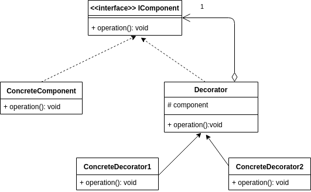
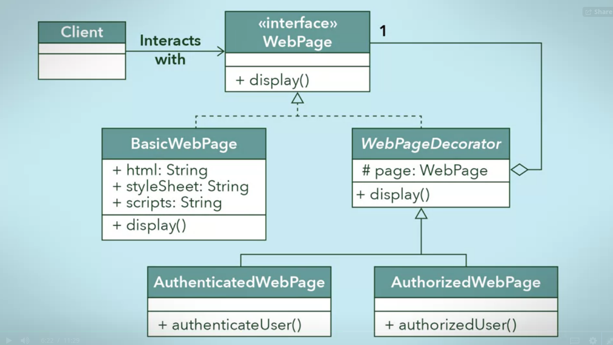

# Decorator Design Pattern
Uses aggregation to combine behaviours at runtime.
aggregation - weak containment or has-a relationship
aggregation stack - at each level it knows it's own behaviour and augments the one underneath it in the stack.

Decorator is a abstract class, implements component interface.
Decorator aggregates other types of components inorder to stack components on one another.
Decorator abstract superclass - super behaviour

